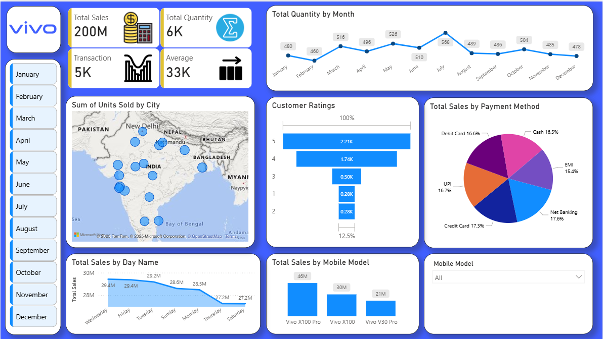

# Vivo Mobile Sales Analysis Dashboard (Python & Power BI)

## Project Overview
This project demonstrates an end-to-end data analytics solution created to track sales performance for **Vivo Mobile** in the Indian market.

Unlike standard projects that rely on pre-existing datasets, I took a **Data Engineering approach** by writing a Python script to generate a realistic, synthetic dataset of 5,000 transactions. The data was then cleaned, modeled, and visualized in **Microsoft Power BI** to provide actionable insights into revenue, customer behavior, and regional trends and more.

## Key Features
* **Automated Data Generation:** A custom Python script (`Data_Generator.ipynb`) that creates realistic retail data, including weighted probabilities for product selection and seasonal trends.
* **Executive KPI Tracking:** Real-time tracking of Total Sales (₹200M+), Total Transactions (5K), and Units Sold.
* **Geo-Spatial Analysis:** An interactive map visualizing sales distribution across major Indian cities (Mumbai, Delhi, Bangalore, etc.).
* **Customer Sentiment Analysis:** A Funnel Chart displaying the distribution of customer ratings to gauge brand satisfaction.
* **Payment Behavior Analysis:** A breakdown of transaction methods (UPI, Credit Card, EMI etc.) to understand financial preferences.
* **Time-Series Forecasting:** Monthly sales trend lines to identify peak seasons and performance dips.

## Tools and Techniques Used
### **Python (Data Engineering)**
* **Libraries:** Pandas, Random, Datetime.
* **Logic:** Weighted randomization for realistic data simulation.
* **Data Export:** CSV generation for external tool integration.

### **Microsoft Power BI (Visualization)**
* **Data Modeling:** Star Schema implementation.
* **DAX (Data Analysis Expressions):** Calculated measures for Average Order Value (AOV) and Year-to-Date (YTD) sales.
* **Power Query:** ETL (Extract, Transform, Load) processes for data cleaning.
* **Interactive Visuals:** Slicers, Map Visuals, Funnel Charts, and Donut Charts.

## Project Files
| File Name | Description | Link |
| :--- | :--- | :--- |
| **Vivo_Sales_Dashboard.pbix** | The main Power BI file containing the dashboard and data model. | [View File](https://github.com/deveshyadav0026/Mobile-Sales-Analysis-PowerBI/blob/main/5k_Vivo_Transactions.xlsx) |
| **data_generator.py** | The Python script used to generate the 5,000-row dataset. | [View Code](https://github.com/deveshyadav0026/Mobile-Sales-Analysis-PowerBI/blob/main/Data_Generator.ipynb) |
| **5k_vivo_transactions.csv** | The raw dataset generated by the script and used for analysis. | [View Data](https://github.com/deveshyadav0026/Mobile-Sales-Analysis-PowerBI/blob/main/5k_Vivo_Transactions.xlsx) |
| **dashboard_screenshot.jpg** | A high-quality preview of the final dashboard. | [View Image](https://github.com/deveshyadav0026/Mobile-Sales-Analysis-PowerBI/blob/main/Dashboard_Screenshot.png) |

## Dashboard Preview

## Business Questions Answered
This dashboard provides answers to critical business questions, such as:
1.  **What is the total revenue and sales volume generated over the last year?**
2.  **Which specific mobile models (e.g., Vivo X100 vs. Y200) are driving the most revenue?**
3.  **How does sales performance vary across different cities (Tier 1 vs. Tier 2)?**
4.  **What are the preferred payment methods for high-value transactions vs. budget phones?**
5.  **How satisfied are customers based on rating distributions (1-star vs. 5-star)?**
6.  **Which months experienced the highest sales traffic, and can we correlate this with festivals?**

## How to Use
1.  **Clone the Repository:**
    Download the files to your local machine.
2.  **Generate Fresh Data (Optional):**
    If you have Python installed, run `data_generator.py` to create a new `5k_vivo_transactions.csv` file with different random values.
3.  **Open in Power BI:**
    Open the `Vivo_Sales_Dashboard.pbix` file. If you generated new data, click "Refresh" in Power BI to load the new numbers.
4.  **Interact:**
    Use the City slicers and Month selectors to filter the data and uncover insights.

## Author
**Devesh Yadav**
